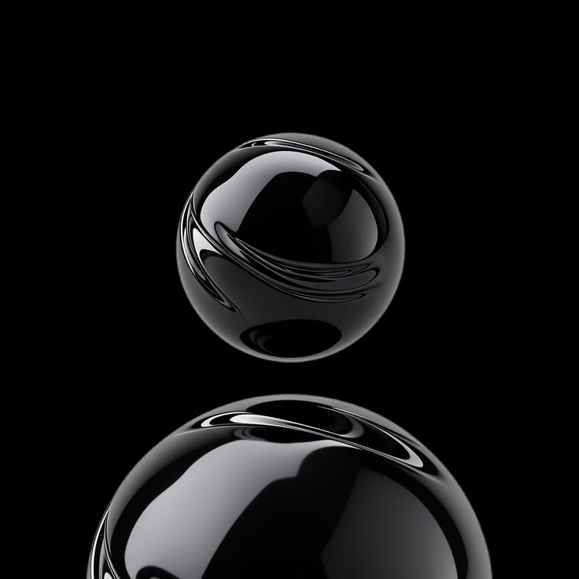

<div align="center">



<br/>

# ESAM64bit


</div>

<br/>

### ◼ نبذة | About

```
> currently   : GLASS AI OPNE
> learning    : GLASS AI OPNE
> open to     : collaboration
```

### ◼ التقنيات | Stack

<div align="center">


</div>

### ◼ إحصائيات | Stats

<div align="center">


</div>

### ◼ تواصل | Contact

<div align="center">

[](https://www.youtube.com/@ESAM64bit)
[](https://www.linkedin.com/in/essam-mesbah-a52278433)
[](https://www.reddit.com/user/ESAM64bit)
[](mailto:wtnzzzz6@gmail.com)

</div>
